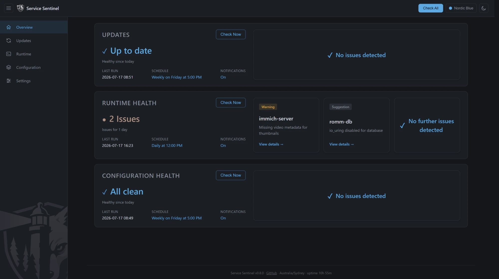
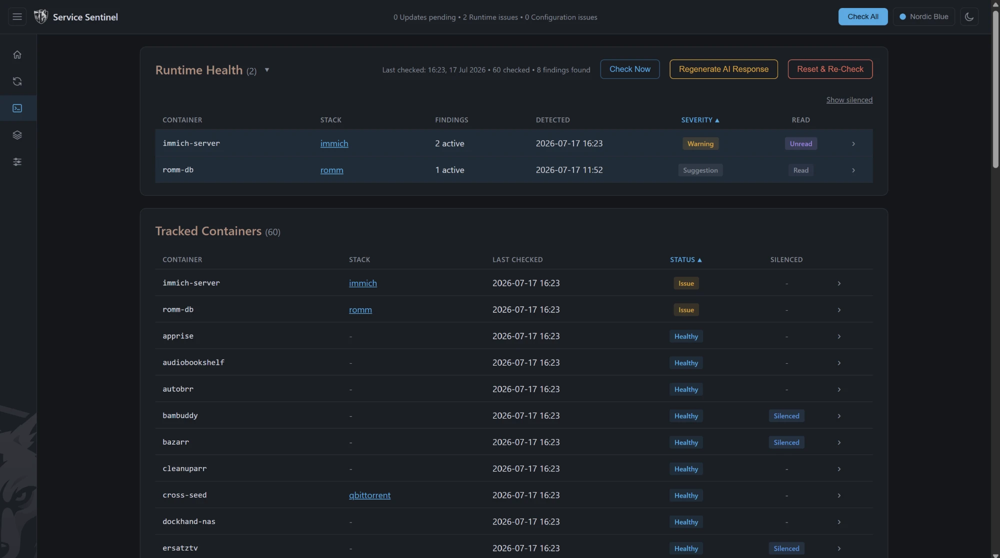
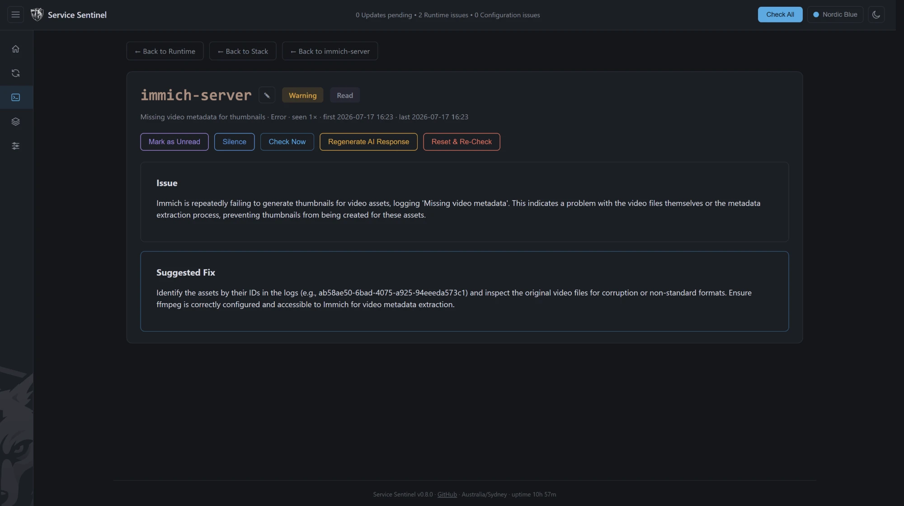
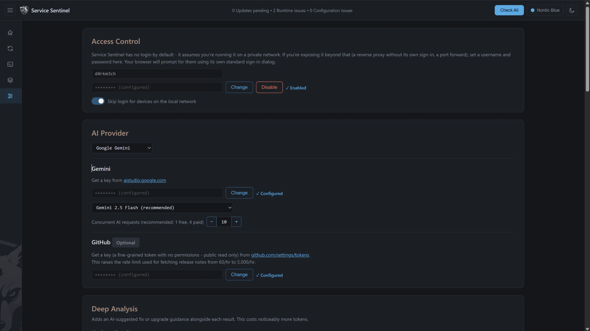
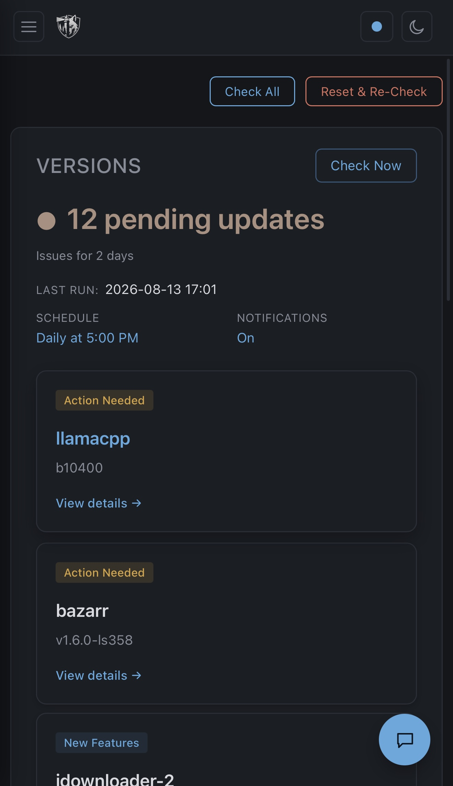
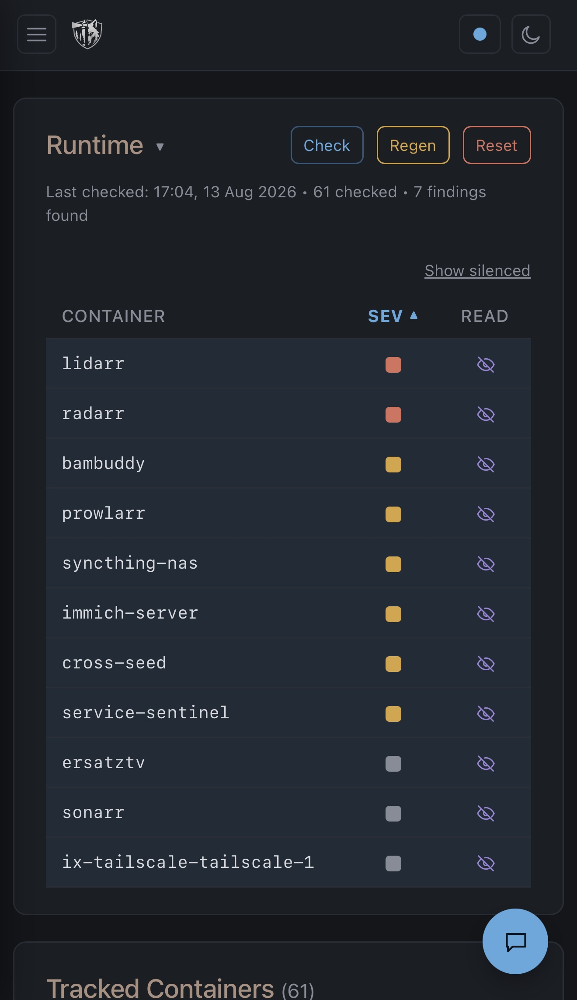
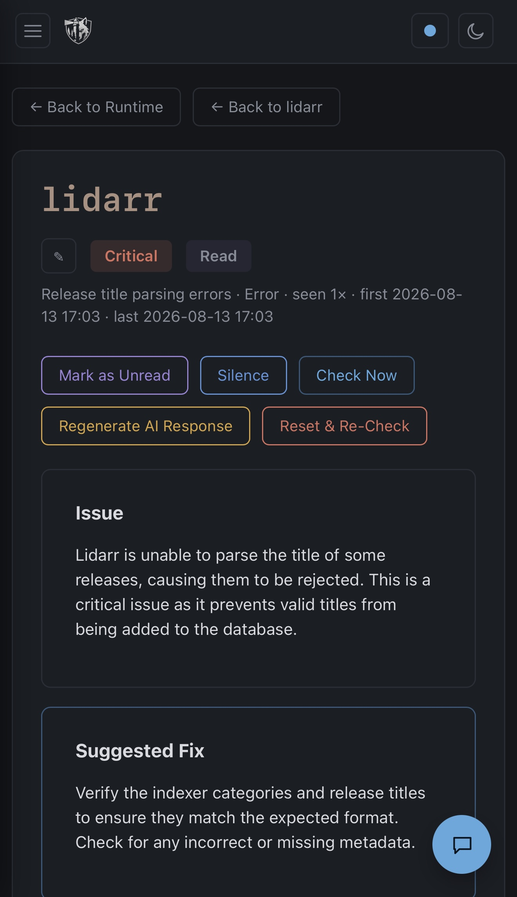

<picture>
  <source media="(prefers-color-scheme: dark)" srcset="app/static/logo-white.svg">
  
</picture>

# Service Sentinel

An AI-assisted dashboard for your homelab's Docker containers: what updates actually change,
whether your logs show a real problem, and whether your compose files have security or
reliability issues. Point it at your Docker socket and your compose folder and it takes it from
there.

## Features

- **Update checks** - compares running containers against their registries and has your AI
  provider summarize what changed and whether it's likely to break your setup.
- **Runtime health** - watches container logs for genuine problems, filtered locally first so a
  clean container never costs an API call.
- **Configuration health** - reviews compose files for security, reliability, and optimization
  issues whenever they change.
- **Chat** - ask about the current state of your setup, or confirm a suggested action (silence a
  finding, add a standing rule) straight from the chat panel.

Each feature is off by default and runs on its own schedule once you turn it on, or on demand
from a Check Now button.

## Screenshots









The interface is fully responsive:

<p>
  
  
  
</p>

## Setup

```yaml
services:
  service-sentinel:
    image: ghcr.io/d4rkm3ch/service-sentinel:latest
    container_name: service-sentinel
    restart: unless-stopped
    ports:
      - "8420:8000"
    environment:
      - TZ=UTC
      - PUID=${PUID}
      - PGID=${PGID}
    volumes:
      - /var/run/docker.sock:/var/run/docker.sock:ro
      - /opt/stacks:/compose:ro
      - service-sentinel-data:/data

volumes:
  service-sentinel-data:

networks: {}
```

The Docker socket and your compose folder only need to be mounted read-only. See
`docker-compose.example.yml` for a hardened version of the same setup (read-only root
filesystem, a dedicated `/etc` volume) and `.env.example` for the full list of variables with
their defaults.

| Variable | Default | Description |
| --- | --- | --- |
| `TZ` | `UTC` | Timezone used for schedules and timestamps |
| `PUID` | `1000` | User ID the container runs as |
| `PGID` | `1000` | Group ID the container runs as |

Everything else, your AI provider and its API key, the GitHub token, notifications, and each
feature's schedule, is set from the Settings page after the container is up, and takes effect
immediately with no redeploy.

## Per-container labels

Add these to a service in your compose file to override the default behavior:

```yaml
labels:
  servicesentinel.ignore: "true"                    # skip this container for update checking
  servicesentinel.logs.ignore: "true"               # skip this container for log watching
  servicesentinel.source: "owner/repo"               # force the GitHub repo used for release notes
  servicesentinel.changelog_url: "https://example.com/changelog"  # use this URL directly, skip auto-detection
```

## Security

There's no login by default, since the app assumes it's running on a trusted private network,
but an onboarding prompt on first launch lets you set a username and password (Settings ->
Access Control if you change your mind later). Everything secret it stores, API keys, the
Apprise URL, that password, is always encrypted at rest, using either an auto-generated key or
your own `SECRETS_ENCRYPTION_KEY` passphrase. The Docker socket is mounted read-only and the app
only ever issues list/inspect calls against it; for a hard enforcement boundary rather than a
code-reviewed one, put a socket proxy in front of it. Compose files sent to the AI for review
are redacted for anything that looks like a secret first, but that's best-effort: keep truly
sensitive values out of compose files entirely.

## Backup and restore

Everything lives in the `service-sentinel-data` volume: the SQLite database plus, unless you set
`SECRETS_ENCRYPTION_KEY`, the auto-generated encryption key that the database's stored secrets
are unrecoverable without. Stop the container first (SQLite files copied mid-write can be
inconsistent), then copy both out:

```bash
docker compose stop service-sentinel
docker cp service-sentinel:/data/service_sentinel.db ./service_sentinel.db.backup
docker cp service-sentinel:/data/secrets.key ./secrets.key.backup
docker compose start service-sentinel
```

To restore, stop the container, copy the backups over the same paths, and start it again.

## Status

An ongoing homelab project, not a hardened production tool. Registry support currently covers
Docker Hub and GHCR (and lscr.io, which fronts GHCR) over the standard OCI distribution API.
Private registries, non-semver tag schemes, and multi-arch edge cases aren't fully handled yet;
see `app/registry.py` for current gaps.

## Development

Built by one person for their own homelab, with heavy use of AI-assisted coding throughout.
Issues and pull requests are welcome, but treat this as a personal project rather than a
supported product.

## License

[MIT](LICENSE)
